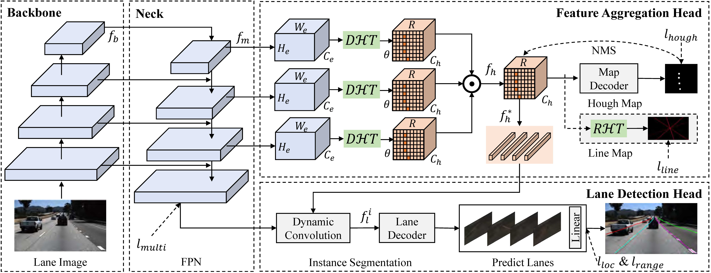
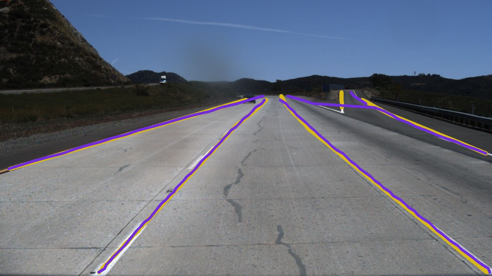
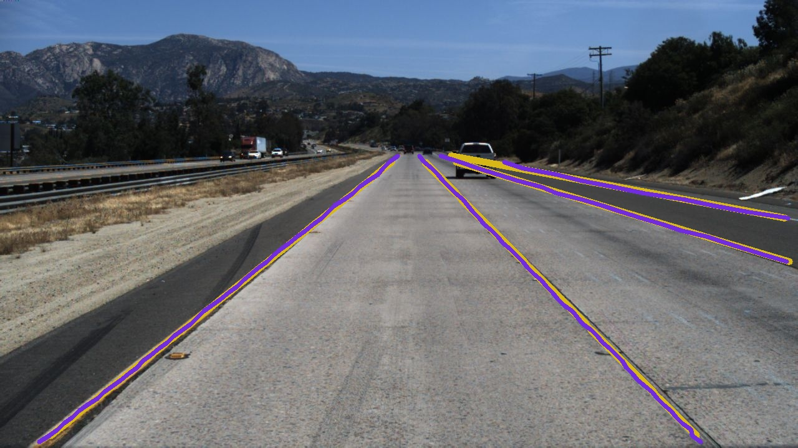
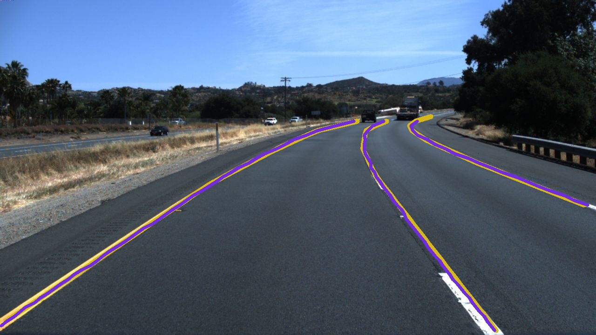
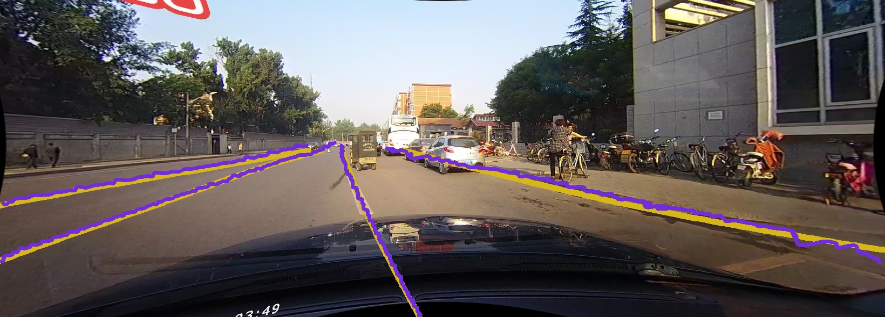
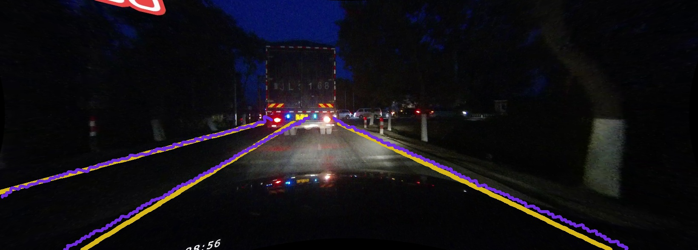
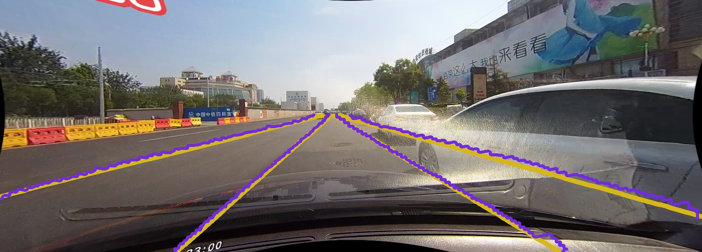

# HoughLaneNet: lane detection with deep hough transform and dynamic convolution

This repository contains the code for the HoughLaneNet model described in *HoughLaneNet: lane detection with deep hough transform and dynamic convolution* ([Paper Link](https://arxiv.org/pdf/2307.03494.pdf)), Zhang et al., 2023. HoughLaneNet adapts [DeepHoughTransform](https://github.com/Hanqer/deep-hough-transform) to detect instance-level lane markings and produce pixel-level segmentation of lanes in a single-stage framework.

This code is based on [MMDetection](https://github.com/open-mmlab/mmdetection) framework and is tested under Ubuntu 20.04.




## Requirements

+ 64-bit Python 3.8 or higher
+ CUDA 11.3
+ Pytorch (>=1.10.0) and torchvision (>=0.11.1)
+ Install mmcv (should match Pytorch version)
  ```bash
  conda create -n mmlab python=3.8 -y
  conda activate mmlab
  conda install pytorch==1.10.0 torchvision torchaudio cudatoolkit=11.3 -c pytorch
  python -m pip install mmcv-full==1.5.0 -f https://download.openmmlab.com/mmcv/dist/cu113/torch1.10/index.html
  ```
+ Python libraries: `opencv-python scipy tqdm matplotlib einops albumentations tensorboard future ujson pycocotool terminaltables`
+ Install mmdetection with the following commands:
  ```bash
  git clone https://github.com/open-mmlab/mmdetection.git
  cd mmdetection
  pip install -v -e .
  ```
+ Install the deep-hough-transform operator with the following commands:
  ```bash
  cd HoughLaneNet
  cd mmdet/models/utils/dht_op
  python setup.py build
  python setup.py install
  ```

## Prepare training and evaluation datasets

Experiments are conducted on TuSimple, CULane, LLAMAS datasets. Please refer to [datasets.md](./docs/datasets.md) for preparing benchmark datasets.


## Use pretrained weights

For training backbone with PVTv3-b3, download the pretrained weights from [here](https://drive.google.com/uc?id=1URr9AlPyRWy_m3CxJSJXnlpgJWwJ919Z) and put it under `pretrained_weights` directory:

```bash
mkdir pretrained_weights # if it does not already exists
cd pretrained_weights

# download pvt-b3 weights
gdown "https://drive.google.com/uc?id=1URr9AlPyRWy_m3CxJSJXnlpgJWwJ919Z"
```

Then the directory should be like follows:
```
[project-root]/pretrained_weights
├── pvt_v2_b3.pth
├── tusimple
|   ├── res_small
|   ├── res_medium
|   └── res_large
├── culane
|   ├── res_small
|   ├── res_medium
|   ├── res_large
|   └── pvt_b3_large
└── llamas
    ├── res_small
    ├── res_medium
    ├── res_large
    └── pvt_b3_large
```


## Usage

### Train

Command to train a network:
```bash
bash tools/dist_train.sh <path to config file> <num of gpus to use>
```

For example, train the network with Resnet18+FPN config on TuSimple dataset with 3 gpus, run the following command:
```bash
CUDA_VISIBLE_DEVICES=0,1,2 bash tools/dist_train.sh configs/lane/tusimple_res_small_fpn.py 3 --no-validate
```

### Test

Command to evaluate a trained network for TuSimple, CULane and LLAMAS dataset respectively:
```bash
bash tools/single_metric_tusimple.sh <path to config file> <path to checkpoint file> --eval
bash tools/dist_metric_culane.sh <path to config file> <path to checkpoint file> <num of gpus to use> --eval
bash tools/dist_metric_llamas.sh <path to config file> <path to checkpoint file> <num of gpus to use> --eval
```

For example, run the following command:
```bash
# TuSimple test dataset evaluation
CUDA_VISIBLE_DEVICES=0 bash tools/single_metric_tusimple.sh configs/lane/tusimple_res_small.py ./pretrained_weights/tusimple/res_small/epoch.pth --eval

# CULane test dataset evaluation
CUDA_VISIBLE_DEVICES=0,1,2 bash tools/dist_metric_culane.sh configs/lane/culane_pvt_b3_large.py ./pretrained_weights/culane/pvt_b3_large/epoch.pth 3 --eval

# LLAMAS test dataset evaluation
CUDA_VISIBLE_DEVICES=0,1,2 bash tools/dist_metric_llamas.sh configs/lane/llamas_pvt_b3_large.py ./pretrained_weights/llamas/pvt_b3_large/epoch.pth 3 --eval
```

### Inference

Run the following scripts to predict the position of lanes and output the visualization results.

```bash
# TuSimple test dataset evaluation
CUDA_VISIBLE_DEVICES=0 bash tools/single_disp_tusimple.sh configs/lane/tusimple_res_large.py ./pretrained_weights/tusimple/res_large/epoch.pth --eval --data-dir ./demo/input/ --show-dir ./demo/output/

# CULane test dataset evaluation
CUDA_VISIBLE_DEVICES=0 bash tools/single_disp_culane.sh configs/lane/culane_res_large.py ./pretrained_weights/culane/res_large/epoch.pth --eval --data-dir ./demo/input/ --show-dir ./demo/output/
```

The following shows some prediction results on the TuSimple and CULane test datasets. The yellow lines represent the positions of the real lanes, while the purple lines represent the positions of the model predicted lanes.

<div align=center>



</div>

<div align=center>



</div>


## Results and Pretrained Models

**TuSimple**

Model | F1 | Accuracy | Speed (FPS) | Pretrained Model
---:|:---:|:---:|:---:|:---
Small(ResNet-18) | 97.67 | 96.71 | 172 | [download](https://drive.google.com/uc?id=11E5aUbQJOxPLbJqAqTF36lj9oQp-B2IX)
Medium(ResNet-34) | 97.68 | 96.93 | 125 | [download](https://drive.google.com/uc?id=1GYMb7efj7H3VEMCkg3g4ns9tmFs6U5T7)
Large(ResNet-101) | 97.31 | 96.43 | 57 | [download](https://drive.google.com/uc?id=1j4EidFb-LNl8xvom9zwpPfYSgH1OdwQS)


**CULane**

Model | F1 | Speed (FPS) | Pretrained Model
---:|:---:|:---:|:---
Small(ResNet-18) | 78.73 | 155 | [download](https://drive.google.com/uc?id=1crhZPCE8o8rJbwzxgvOwUBQK5Wc6npr7)
Medium(ResNet-34) | 78.87 | 148 | [download](https://drive.google.com/uc?id=1aV3rLvTXy7-0804lAPPfwmhSXPCIvTD1)
Large(ResNet-101) | 78.97 | 56 | [download](https://drive.google.com/uc?id=13uFHH8ZEfBJ1TF027TW2vr2HwxKJVqtI)
Large(PVTv2-b3) | 79.81 | 61 | [download](https://drive.google.com/uc?id=1NoR-fIK-Lu6EeaR8mmF3DfkLYw4xp1WC) 


**LLAMAS**

Model | F1 (Valid) | F1 (Test) | Speed (FPS) | Pretrained Model
---:|:---:|:---:|:---:|:---
Small(ResNet-18) | 96.03 | 94.75 | 131 | [download](https://drive.google.com/uc?id=14GQF_uPNLrJyk2FFYZicQGN9I3uZjqny)
Medium(ResNet-34) | 95.64 | 94.98 | 110 | [download](https://drive.google.com/uc?id=1LirdPZKG7Y84oxTAlRmhXbM9AXb4Wq7u)
Large(ResNet-101) | 95.95 | 95.00 | 48 | [download](https://drive.google.com/uc?id=15VqTHS7zO4HMDGO3LFC5ihcizs19hOxh)
Large(PVTv2-b3) | 96.31 | 95.49 | 42 | [download](https://drive.google.com/uc?id=1KczPxVSkK-dEXxqobKD7ojvvnzg1p5Sw)


## Citation

If you consider our work useful, please cite the following paper:
```
@misc{zhang2023houghlanenet,
      title={HoughLaneNet: Lane Detection with Deep Hough Transform and Dynamic Convolution}, 
      author={Jia-Qi Zhang and Hao-Bin Duan and Jun-Long Chen and Ariel Shamir and Miao Wang},
      year={2023},
      eprint={2307.03494},
      archivePrefix={arXiv},
      primaryClass={cs.CV}
}
```


## License

This project is licensed under the [Creative Commons NonCommercial (CC BY-NC 3.0)](https://creativecommons.org/licenses/by-nc/3.0/) license where only
non-commercial usage is allowed. For commercial usage, please contact us.


## Acknowledgement

We have adopted implementation from the following repositories:

+ [deep-hough-transform](https://github.com/Hanqer/deep-hough-transform)
+ [conditional-lane-detection](https://github.com/aliyun/conditional-lane-detection)
+ [LaneATT: Real-time Attention-guided Lane Detection](https://github.com/lucastabelini/LaneATT)
